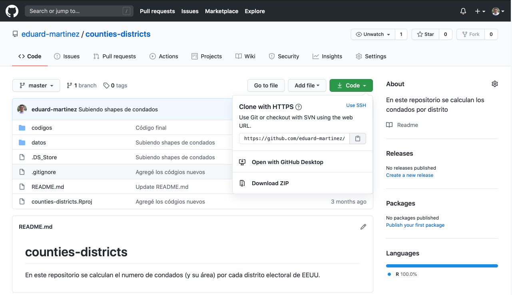
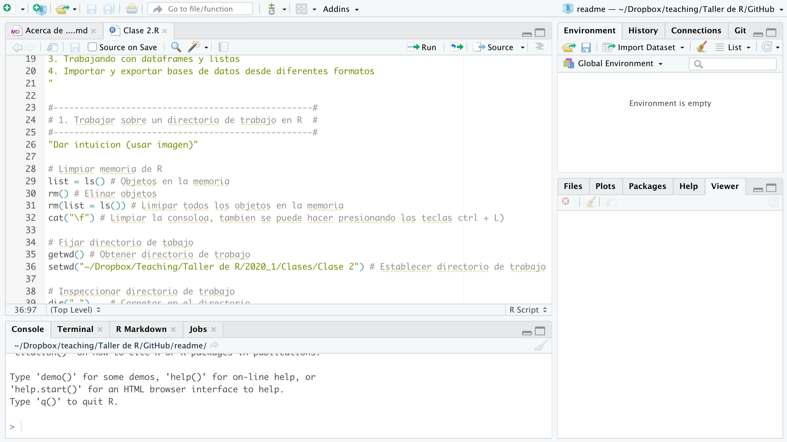

# Acerca de ...

+ Este repositorio contiene información relevante para el curso "Taller de R: Estadística y Programación."
de la Universidad de los Andes.

+ Este no es un curso avanzado de R, está diseñado para introducir a los usuarios en algunas de las posibles aplicaciones de R.

+ El programa del curso se encuentra en la carpeta ***Sylabus***.

+ Aunque el curso está desarrollado completamente en español, no se usan acentos ni caracteres especiales dentro de los scripts de las clases; Esto último para evitar conflictos entre los diferentes sistemas operativos.

+ Antes de empezar vea la sección ***Antes de ...***

### 1. Organización del curso:

El curso está dividido en 16 clases, las cuales se distribuyen a los largo de 5 módulos. Para cada clase se crea un repositorio que contiene cuatro carpetas con el material del curso. El contenido detallado de cada clase se encuentra en el Sylabus.

* ***Módulo 1:*** Introducción a R

  + ***Clase_01:*** Introducción a R.
  + ***Clase_02:*** Estructuras de datos en R.
    
* ***Módulo 2:*** Data Tidying 

  + ***Clase_03:*** Importar y exportar bases de datos.
  + ***Clase_04:*** Limpieza de bases de datos parte 1.
  + ***Clase_05:*** Limpieza de bases de datos parte 2.
  + ***Clase_06:*** Limpieza de bases de datos parte 3.
   
* ***Módulo 3:*** Iterar procesos

  + ***Clase_07:*** Loops (For, While,  )
  + ***Clase_08:*** Familia apply
     
* ***Módulo 4:*** Procesamiento de información espacial
    
  + ***Clase_09:*** Introducción a la información espacial en R.
  + ***Clase_10:*** Visualización de la información espacial.
  + ***Clase_11:*** Operaciones con objetos espaciales.
  + ***Clase_12:*** Introducción al procesamiento de imágenes satelitales.
   
* ***Módulo 5:***  Otras aplicaciones
     
  + ***Clase_13:*** Regresiones.
  + ***Clase_14:*** Rmarkdonw. 
  + ***Clase_15:*** Web scraping.  
  + ***Clase_16:*** Minería de texto.
    
    
### 2. Sylabus 

Esta carpeta contiene el programa y las reglas de juego del curso.

### 3. Antes de ...

***1.*** Cada clase está contenida en un repositorio así:

+ ***Clase_01***
+ ***Clase_02***
+ ***Clase_03***
+ ...
+ ***Clase_16***

***2.*** Cada repositorio contiene 4 carpetas:

* ***Codes:*** Contiene el script de la clase.
* ***Data:*** Contiene dos carpetas, Originals y Processed.
  + Originals: Contiene la *raw data* (datos originales), es decir la información tal cual como se obtiene de la fuente original.
  + Processed: Contiene la *tidy data* (datos procesados), es decir, las bases de datos que se obtiene al correr los scripts de la carpeta  ***Codes***.
* ***Help:*** Contiene el material de apoyo para la clase.
* ***Video:*** Contiene (no siempre) el vídeo con la explicación de la clase.

***3.*** Para replicar una clase, usted debe ir al repositorio de la clase y hacer clic en ***Code***.  

Después debe descargar el repositorio haciendo clic en ***Download ZIP*** (En la segunda clase aprenderemos una forma de hacerlo directamente desde R). Posteriormente debe ir a la carpeta ***Codes*** y abrir el *Script* de la clase, para replicar la clase solo debe cambiar el directorio de trabajo (linea 36 del código) por la ruta a la carpeta del repositorio en su computador.

***4.*** Por último, espero este curso les sirva para aprender un poco de esta poderosa herramienta!
