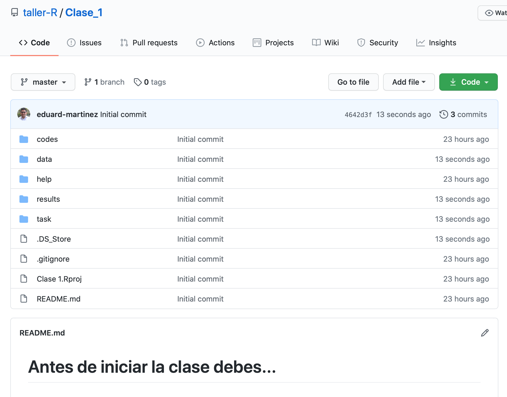

# Acerca de esta cuenta

+ Este repositorio contiene las instrucciones necesarias para replicar el curso "Taller de R: Estadística y Programación.".

## 1. Acerca de este curso

#### ¿Qué es? y ¿Qué no es?

* Este no es un curso dedicado a hacer econometría usando R. A lo largo del curso empleamos distintos conceptos estadísticos, pero la econometría no es el core del curso.  

* Este no es un curso avanzado de R. Desde las primeras las clases, el curso está pensado para personas que nunca han tenido contacto con la programacion. 

* Este curso está diseñado para introducir a los usuarios en métodos computacionales para la investigación económica.

#### Algunos comentarios adicionales

* Aunque el curso está desarrollado completamente en español, no se usan acentos ni caracteres especiales dentro de los scripts de las clases; Esto último para evitar conflictos entre los diferentes sistemas operativos.

* Los comentarios para mejorar el contenido del curso son bienvenidos.

## 2. Acerca de las clases

Para replicar las clases del curso, usted deberia revisar los videos 1 y 2 de este [enlace](https://www.dropbox.com/sh/wsa52fb66ey8irm/AADt86NnPK5F-t_oaUjV1zKea?dl=0) y en este otro [enlace](https://eduard-martinez.github.io/blog/github/clonar_github.html) encuentra 3 formas de clonar un repositorio de GitHub usando R. Todos los vídeos, organizados por clase, se encuentran en este [link](https://www.dropbox.com/sh/m36a089n4je6ly0/AAB42iWERL0aNLynIllTKQKua?dl=0).

Para cada clase se crea un repositorio en la [cuenta](https://github.com/taller-R) del curso en GitHub. Cada repositorio contiene 6 carpetas y un archivo README.md que contiene las instrucciones iniciales de la clase. En este archivo también se encuentran los link a los videos de la clase. Los vídeos de las clases (incluidos los de este repositorio) se encuentran organizados por carpetas aquí.  

Ademas, el repositorio contiene 6 carpetas con el material de la clase:

* **help:** 

Esta carpeta contiene 1 carpeta con los gráficos de apoyo para la clase y 2 archivos (.Rdm y .html). 

El archivo .Rdm contiene el código de Rmarkdown para generar el archivo .html de la clase (este ultimo es el que realmente importa).

El archivo .html contiene el material de apoyo para la clase. Debe abrir este archivo (haciendo doble clic sobre el) en paralelo con el script de la clase. En este archivo, generalmente se muestran gráficos que ayudan a entender la intuición de lo que se está haciendo el script de la clase. En este archivo también se encuentran los link a los videos de la clase.

* **codes:** 

Esta carpeta contiene el script (editor de sintaxis) que vamos a usar en la clase.

* **data:**

Esta carpeta contiene dos carpetas (originals y processed) con las bases de datos que vamos a usar en la clase. La carpeta **originals** contiene la *raw data* (datos originales), es decir la información tal cual como se obtiene de la fuente original. La cual será procesada con el script de la clase. Por su parte, la carpeta **processed** contiene la *tidy data* (datos procesados), es decir, las bases de datos que se obtiene al correr el script de la clase.

* **Results:** 

Esta carpeta generalmente contiene algunos de los gráficos que se producen en el script de la clase.

* **Task:** 

Esta carpeta contiene un archivo .html con algunas instrucciones para realizar ejercicios de los temas vistos en clase. La intención es que los estudiantes puedan afianzar los conocimientos de la clase empleando bases de datos de instituciones como [DANE](https://www.dane.gov.co). 

Posteriormente se incluirá otro archivo .html adicional con las respuestas a los ejercicios.

## 3. Programa del curso.

El curso está dividido en 16 clases, las cuales se distribuyen a lo largo de 5 módulos así.

* ***Módulo 1:*** Introducción a R

  + ***Clase_01:*** Introducción a R.
  + ***Clase_02:*** Estructuras de datos en R.
    
* ***Módulo 2:*** Data Tidying 

  + ***Clase_03:*** Limpieza de bases de datos parte 1.
  + ***Clase_04:*** Limpieza de bases de datos parte 2.
  + ***Clase_05:*** Limpieza de bases de datos parte 3.
  + ***Clase_06:*** Gráficos en R.
   
* ***Módulo 3:*** Iterar procesos

  + ***Clase_07:*** Loops (For, While, repeat)
  + ***Clase_08:*** Familia apply
     
* ***Módulo 4:*** Procesamiento de información espacial
    
  + ***Clase_09:*** Introducción a la información espacial en R.
  + ***Clase_10:*** Visualización de la información espacial.
  + ***Clase_11:*** Operaciones con objetos espaciales.
  + ***Clase_12:*** Introducción al procesamiento de imágenes satelitales.
   
* ***Módulo 5:***  Otras aplicaciones
     
  + ***Clase_13:*** Regresiones.
  + ***Clase_14:*** Rmarkdonw y Shiny. 
  + ***Clase_15:*** Web scraping.  
  + ***Clase_16:*** Minería de texto.
